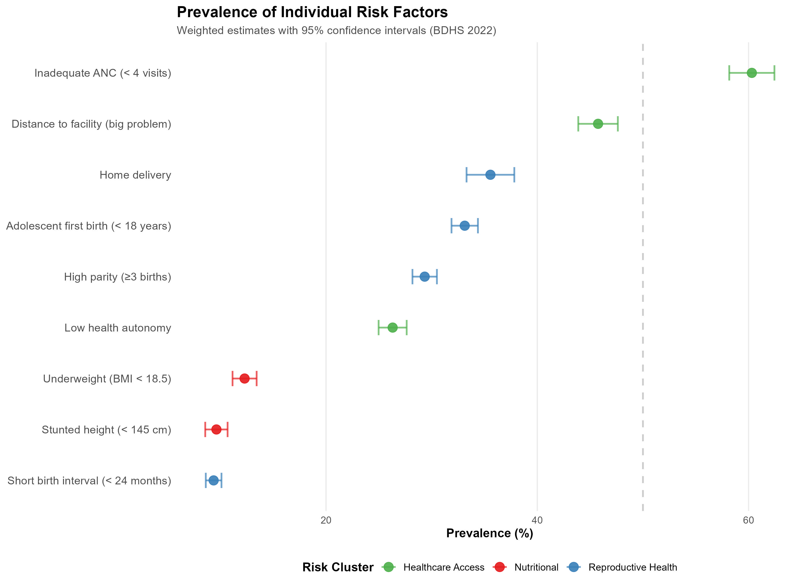
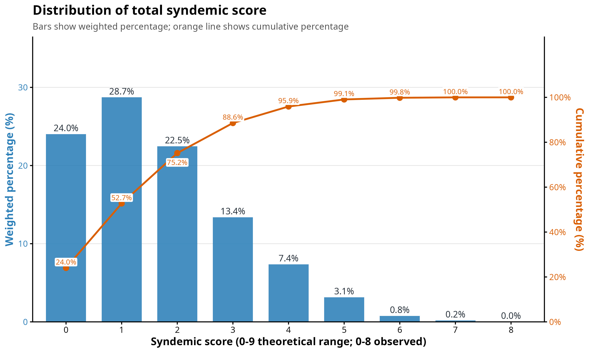
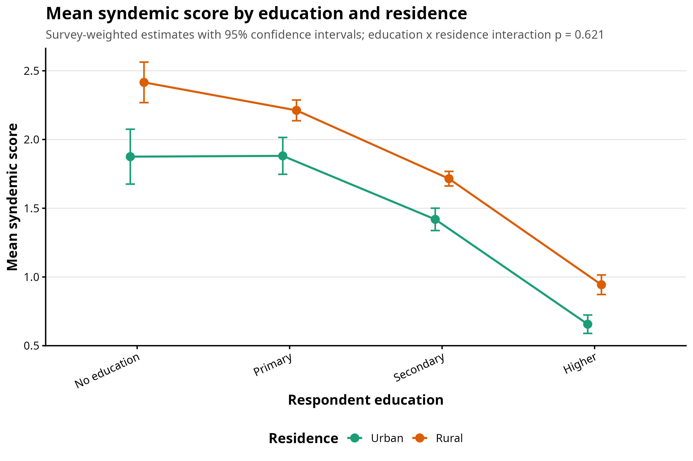
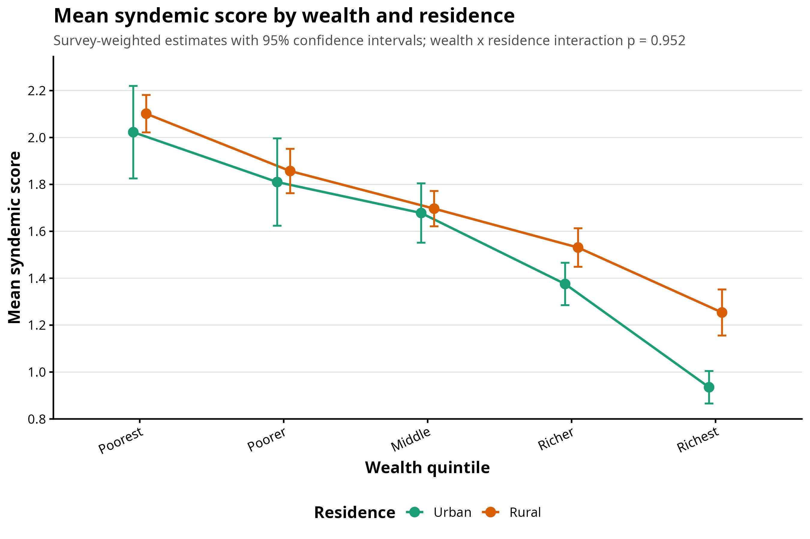
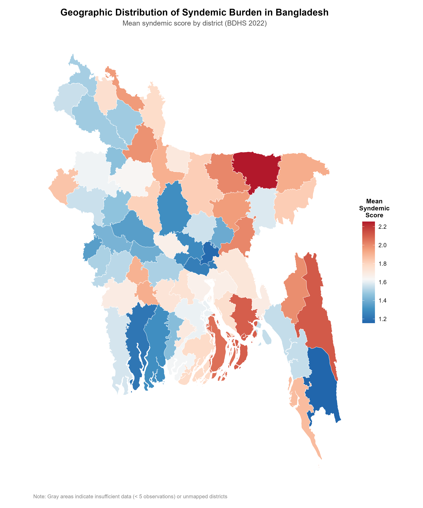
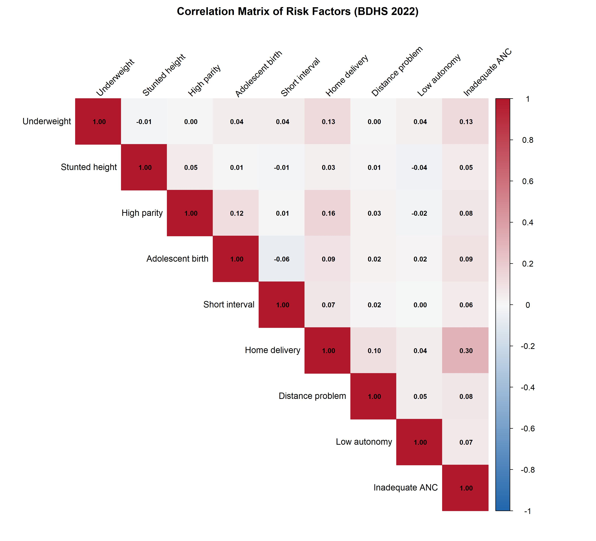

```{r}
#| label: setup
#| include: false
library(dplyr)
library(ggplot2)
library(knitr)
library(readr)
library(stringr)
library(tidyr)

theme_set(theme_minimal(base_size = 13))

pct1 <- function(x) sprintf("%.1f%%", x)

format_effect <- function(effect, ci_low, ci_high) {
  sprintf("%.2f (%.2f–%.2f)", effect, ci_low, ci_high)
}

clean_variable_group <- function(variable) {
  case_when(
    variable == "age_group"        ~ "Age group",
    variable == "education"        ~ "Respondent education",
    variable == "wealth"           ~ "Wealth quintile",
    variable == "residence"        ~ "Residence",
    variable == "division"         ~ "Division",
    variable == "employment"       ~ "Employment",
    variable == "husband_education"~ "Husband's education",
    TRUE                           ~ variable
  )
}
```

## Abstract

::: {.abstract-box}
**Background.** Women in Bangladesh experience overlapping nutritional, reproductive-health, and healthcare-access constraints. A syndemic lens is useful when such risks cluster within socially patterned contexts, but empirical claims require more than a simple count of co-occurring conditions.

**Objective.** This study estimated the burden, clustering, and social patterning of co-occurring risks among women aged 15–49 using BDHS 2022.

**Methods.** Nine binary indicators were grouped into nutritional, reproductive-health, and healthcare-access/autonomy domains. The primary outcome was the cumulative syndemic-burden score (range 0–9; observed 0–8), analyzed using survey-weighted quasi-Poisson regression and reported as incidence rate ratios (IRR). Ordinal logistic regression (low/medium/high burden) was used as a sensitivity analysis. All models incorporated BDHS sampling weights, primary sampling units, and strata.

**Results.** Among 11,657 women with recent births, 24.0% had a score of 0, 64.6% scored 1–3, and 11.4% scored ≥4 (high burden). Any reproductive-health risk affected 57.6% of women and any access/autonomy risk affected 73.8%. All three risk domains co-occurred more than expected under independence (observed/expected ratio 1.23). In the full quasi-Poisson model, higher respondent education (IRR 1.00 reference), rural residence (IRR 1.11, 95% CI 1.06–1.16), and lower wealth were associated with elevated burden, while working women had lower scores (IRR 0.94, 95% CI 0.91–0.98). Ordinal sensitivity results were directionally consistent.

**Conclusion.** The findings support a socially patterned cumulative-burden interpretation. Evidence for clustering is present, but the report avoids claiming definitive causal or biological synergy because the analysis is cross-sectional and lacks a downstream health outcome independent of the component risks.
:::

## Study Snapshot

::: {.metric-grid}
::: {.metric}
[11,657]{.metric-value}
[women in analytic sample]{.metric-label}
:::

::: {.metric}
[11.4%]{.metric-value}
[high burden, score ≥4]{.metric-label}
:::

::: {.metric}
[1.23]{.metric-value}
[observed/expected ratio, all 3 domains co-occurring]{.metric-label}
:::

::: {.metric}
[IRR 1.11]{.metric-value}
[rural vs urban, quasi-Poisson full model]{.metric-label}
:::

::: {.metric}
[IRR 2.06]{.metric-value}
[no education vs higher education]{.metric-label}
:::

::: {.metric}
[IRR 1.39]{.metric-value}
[poorest vs richest wealth quintile]{.metric-label}
:::
:::

## Introduction

Syndemic theory describes the clustering and interaction of health problems under harmful social conditions [@singer2017syndemics; @mendenhall2017ncd]. The key distinction is that a syndemic is not merely multimorbidity. A defensible syndemic analysis should show clustering, identify social or structural drivers, and assess whether co-occurrence appears greater or more consequential than expected from independent risks [@tsai2018syndemics; @bulled2024guide].

Bangladesh is a strong setting for this framework because women's health is shaped by intersecting nutritional vulnerability, early and high-parity reproduction, barriers to maternal healthcare, and constraints on decision-making autonomy. BDHS 2022 provides nationally representative data on women of reproductive age, household socioeconomic position, reproductive history, maternal service use, and healthcare access constraints [@niport2024bdhs; @worldbank2024bdhsmetadata].

Prior Bangladesh evidence shows persistent socioeconomic inequalities in women's undernutrition [@rahman2022undernutrition; @hossain2023doubleburden; @rahman2019doubleburden], geographic and wealth gradients in nutritional burden across Southeast Asia [@biswas2022southeastasia], and strong links between child marriage, adolescent motherhood, education, residence, and partner characteristics [@islam2021childmarriage; @unicef2025childmarriage; @who2024adolescentpregnancy]. Maternal healthcare studies similarly show that institutional delivery, antenatal care, and the continuum of care are patterned by wealth, education, residence, and women's autonomy [@chakraborty2003maternal; @yaya2017delivery; @kamal2015institutional; @kamal2015skilledbirth; @khan2020urban; @khan2022continuum; @haider2017autonomy]. This study brings these strands together by modeling co-occurring risks as a cumulative burden.

### Study Aims

1. Estimate the weighted prevalence of individual risk factors and cumulative burden.
2. Assess whether nutritional, reproductive-health, and access/autonomy domains cluster more than expected under independence.
3. Identify sociodemographic predictors of elevated burden using survey-weighted quasi-Poisson regression.
4. Evaluate robustness with ordinal logistic and cutoff sensitivity analyses.

## Conceptual Framework

```{mermaid}
graph LR
    A["STRUCTURAL DRIVERS<br>Socioeconomic status<br>Education opportunities<br>Residence and Geography<br>Policy environment"]
    B["SOCIAL ENVIRONMENT<br>Employment status<br>Household dynamics<br>Healthcare quality<br>Gender-based autonomy"]
    C["PATHWAYS<br>Nutritional intake<br>Reproductive timing<br>Birth spacing<br>Service utilization"]
    D["SYNDEMIC CLUSTERS<br>Nutritional Risks<br>Reproductive Risks<br>Healthcare-Access Risks"]
    E["OUTCOMES<br>Cumulative score (0-8)<br>Low, Medium, High burden"]

    A --> B
    B --> C
    C --> D
    D --> E
    E -.-> A
```

The framework (adapted from Solar & Irwin, 2010 and Tsai, 2024) treats social determinants as upstream conditions that pattern multiple proximal risk domains. The feedback loop at the bottom represents the **biosocial nature** of syndemics: the accumulated health burden (outcomes) can reinforce and exacerbate the very structural and social inequalities that initially produced the risks.


## Methods

### Data Source and Study Population

The analysis utilized the 2022 Bangladesh Demographic and Health Survey (BDHS), a nationally representative cross-sectional survey [@niport2024bdhs]. The study population was restricted to ever-married women aged 15–49 who had a live birth in the three years preceding the survey to ensure the availability of maternal healthcare and decision-making indicators.

```{mermaid}
graph TD
    A["Ever-married women interviewed (15–49 years)<br/>(N = 30,344)"]
    
    E1["Excluded: No live birth in the 3 years<br/>preceding the survey (n = 18,687)"]
    
    B["<b>Analytic sample for descriptive statistics</b><br/>(n = 11,657)"]
    
    E2["Excluded: Missing values in multivariable<br/>model covariates (n = 4,031)"]
    
    C["<b>Final sample for multivariable modeling</b><br/>(n = 7,626)"]

    A --> B
    A -.-> E1
    B --> C
    B -.-> E2

    %% Styling
    style B fill:#f0f7ff,stroke:#0056b3,stroke-width:2px
    style C fill:#f4fff4,stroke:#2e7d32,stroke-width:2px
```

Due to the nature of survey skip patterns and item-level non-response, a complete-case approach requiring all nine risk indicators to be observed would have restricted the sample to 1,531 women (13.1% of those with recent births). To maintain population representativeness and statistical power, the primary analysis utilized an **available-indicator** cumulative score, including all 11,657 women for descriptive analysis and 7,626 women for the multivariable modeling where covariate data were complete.

### Outcome and Risk Domains

Nine binary risk indicators were grouped into three functional domains to capture the multi-dimensional nature of the syndemic burden.

```{r}
#| label: risk-domain-table
tibble(
  Domain = c("Nutritional", "Reproductive health", "Healthcare access and autonomy", "**Total Syndemic Score**"),
  Indicators = c(
    "Underweight (BMI < 18.5); stunted height (< 145 cm)",
    "Adolescent first birth (< 20y); high parity (> 4); short birth interval (< 24m); home delivery",
    "Inadequate ANC (< 4 visits); distance to facility (major problem); low health autonomy",
    "Sum of all nine binary indicators (dichotomized 0/1)"
  ),
  `Score Range` = c("0–2", "0–4", "0–3", "**0–9**")
) |>
  kable(caption = "Syndemic risk domains, indicators, and score construction", align = "llc", escape = FALSE)
```

For descriptive reporting and sensitivity analysis, the total score was collapsed into three ordered categories: **Low burden** (score 0), **Medium burden** (score 1–3), and **High burden** (score ≥ 4).

### Covariates and Model Parameters

Multivariable models included sociodemographic factors identified in the literature as key drivers of maternal and nutritional health in Bangladesh.

```{r}
#| label: covariate-table
tibble(
  `Variable Group` = c("Demographic", "Socioeconomic", "Geography", "Empowerment"),
  `Covariates (Levels)` = c(
    "Age group (15–24, 25–34, 35–49)",
    "Respondent education (No education, Primary, Secondary, Higher); Wealth quintile (Poorest to Richest); Husband's education",
    "Administrative Division (8 regions); Type of residence (Urban, Rural)",
    "Employment status (Working, Not working)"
  ),
  `Reference Category` = c("15–24 years", "Higher education; Richest quintile", "Dhaka Division; Urban residence", "Not working")
) |>
  kable(caption = "Covariates included in multivariable regression models", align = "lll")
```

### Statistical Analysis

All descriptive and regression analyses incorporated BDHS survey weights, strata, and primary sampling units using R's `survey` package [@lumley2004survey; @lumley2010complex].

**Primary model:** Survey-weighted quasi-Poisson regression (`svyglm`, `family = quasipoisson`) for the raw syndemic score (0–8). The quasi-Poisson family was selected because the score is a bounded integer with mild overdispersion relative to a simple Poisson process (observed variance/mean ratio = 1.23; svyglm dispersion φ = 0.77; diagnostic weighted GLM φ = 1.08). Negative binomial regression was evaluated but yielded an equivalent fit (θ = 22.20), confirming that quasi-Poisson was sufficient. Results are reported as incidence rate ratios (IRR) with 95% confidence intervals [@hilbe2011negbin; @gardner1995regression].

**Sensitivity analysis:** Ordinal proportional-odds logistic regression for low/medium/high burden categories [@mccullagh1980regression; @liu2016proportional]. The ordinal model provides a complementary perspective using the collapsed categorical outcome; its results are reported in the Supplementary Appendix.

## Results

### Risk Factor Prevalence

The chart below displays the percentage of women affected by each individual risk factor, grouped by their functional domain (Healthcare Access, Reproductive Health, and Nutritional). 

The points represent the estimated percentage (prevalence) in the population, while the horizontal lines show the 95% confidence intervals (the range within which we are certain the true value lies). For instance, **Healthcare Access** risks are the most common, with over 60% of women receiving inadequate antenatal care. In contrast, **Nutritional** risks like underweight and stunted height affect approximately 10–12% of the sample.

```{r}
#| label: risk-factor-prevalence-chart
#| fig-cap: "Weighted prevalence of individual risk factors across three syndemic domains."
#| fig-width: 9
#| fig-height: 5.5

```
### Syndemic Score Distribution

The distribution of the total syndemic score reveals the cumulative nature of risk among women in Bangladesh. While 24% of women have no identified risks, the majority (64.6%) experience between one and three concurrent risks.

```{r}
#| label: score-distribution
#| fig-cap: "Distribution of total syndemic score (weighted, n = 11,657)."
#| fig-width: 8
#| fig-height: 5.5

```

### Syndemic Burden Categories

For descriptive purposes, the syndemic score was collapsed into three ordinal categories representing the level of cumulative burden.

```{r}
#| label: table-burden-categories
#| message: false
burden_data <- read_csv("data/paper_burden_categories.csv", show_col_types = FALSE)

burden_data |>
  transmute(
    `Burden Level` = case_when(
      str_detect(burden_category, "Low")    ~ "Low Burden",
      str_detect(burden_category, "Medium") ~ "Medium Burden",
      str_detect(burden_category, "High")   ~ "High Burden"
    ),
    `Score Range` = case_when(
      str_detect(burden_category, "Low")    ~ "0",
      str_detect(burden_category, "Medium") ~ "1–3",
      str_detect(burden_category, "High")   ~ "≥4"
    ),
    `Unweighted n` = format(unweighted_n, big.mark = ","),
    `Weighted Percentage (%)` = sprintf("%.1f%%", weighted_percent)
  ) |>
  kable(
    caption = "Classification of women by syndemic burden category (n = 11,657)",
    align = "llrr"
  )
```


### Sociodemographic and Geographic Patterning

The syndemic burden is strongly patterned by social determinants and geographic location. Mean syndemic scores across key demographic groups reveal significant disparities, particularly by education level and wealth quintile.

```{r}
#| label: sociodemographic-gradients
#| fig-cap: "Mean syndemic score by key demographics (95% CI)."
#| fig-width: 9
#| fig-height: 8

```

#### Intersectionality: Wealth and Residence

The interaction of household wealth and urban-rural residence further identifies the most vulnerable populations. While higher wealth is protective in both settings, rural women in the lowest wealth quintiles experience a disproportionately high cumulative risk burden.

```{r}
#| label: intersectionality-chart
#| fig-cap: "Intersectionality of wealth and residence: mean syndemic score (95% CI)."
#| fig-width: 8
#| fig-height: 5.5

```

#### Geographic Variation

Geographically, the syndemic burden is not uniform across Bangladesh. Divisions such as Sylhet and Mymensingh exhibit higher average scores and a greater prevalence of high-burden cases compared to divisions like Dhaka or Khulna.

{fig-alt="Geographic map of syndemic burden variation across Bangladesh by division."}

### Multivariable Quasi-Poisson Regression (Primary Model)

Survey-weighted quasi-Poisson regression (φ = 0.77 from the full svyglm model; diagnostic weighted GLM φ = 1.08) was fit for the raw syndemic score. Results are incidence rate ratios (IRR): the multiplicative change in expected syndemic score per unit change in a predictor, holding all other variables constant.

```{r}
#| label: table-3-qp
table3 <- read_csv("data/table3_quasipoisson_irr.csv", show_col_types = FALSE)

table3 |>
  mutate(variable_group = clean_variable_group(variable)) |>
  transmute(
    Group    = variable_group,
    Category = category,
    Reference = if_else(is.na(coefficient), "✓", ""),
    `IRR (95% CI)` = IRR_CI,
    `p-value`      = p_formatted
  ) |>
  kable(
    caption = "Table 3. Survey-weighted quasi-Poisson regression: predictors of syndemic burden score (n = 11,657)",
    align   = "llcll"
  )
```

```{r}
#| label: forest-plot-full-model
#| fig-cap: "Full-model IRRs and 95% confidence intervals from quasi-Poisson regression. IRR < 1 indicates a lower expected syndemic score relative to the reference category."
#| fig-width: 9
#| fig-height: 7.5
forest_data <- table3 |>
  filter(!is.na(coefficient)) |>
  mutate(
    variable_group = clean_variable_group(variable),
    predictor      = paste0(variable_group, ": ", category),
    direction      = if_else(IRR < 1, "Protective", "Risk"),
    predictor      = factor(predictor, levels = predictor[order(IRR)])
  )

ggplot(forest_data, aes(x = IRR, y = predictor, color = direction)) +
  geom_vline(xintercept = 1, linetype = "dashed", color = "gray45") +
  geom_errorbarh(aes(xmin = CI_lower, xmax = CI_upper), height = 0.22, linewidth = 0.8) +
  geom_point(size = 2.8) +
  scale_x_log10() +
  scale_color_manual(values = c("Protective" = "#1b9e77", "Risk" = "#d95f02")) +
  labs(x = "Incidence Rate Ratio (log scale)", y = NULL, color = NULL) +
  theme(legend.position = "bottom")
```

The full model revealed strong social gradients. Compared with women with higher education, those with no education had 2.06 times the expected syndemic score (IRR 2.06, 95% CI 1.90–2.23). Rural residence was associated with an 11% higher score (IRR 1.11, 95% CI 1.06–1.16). Women in the poorest wealth quintile had 39% higher scores than the richest (IRR 1.39, 95% CI 1.30–1.49). Working women had modestly lower scores (IRR 0.94, 95% CI 0.91–0.98). Husband's education showed an independent gradient: no education versus higher (IRR 1.14, 95% CI 1.07–1.22).

### Interaction and Sensitivity Checks

```{r}
#| label: social-interaction-tests
social_interactions <- read_csv("data/paper_social_interaction_tests.csv", show_col_types = FALSE)

social_interactions |>
  transmute(
    Test         = test,
    `F statistic` = sprintf("%.2f", statistic),
    `p-value`    = p_formatted
  ) |>
  kable(caption = "Ordinal model interaction tests (education × residence; wealth × residence)", align = "lrr")
```

The interaction tests do not support statistical effect modification by residence for either wealth or education, indicating the evidence is stronger for broad social patterning than for subgroup-specific slopes.

## Discussion

### Principal Findings

This study found that co-occurring risks are common among women in Bangladesh. Most women had at least one risk, nearly two-thirds were in the medium-burden category, and 11.4% had high burden. Access/autonomy and reproductive-health risks were more common than nutritional risks, but all three domains co-occurred at a rate 23% higher than expected under independence.

The strongest and most consistent predictors were education and wealth. Women with no education had twice the expected syndemic score relative to women with higher education (IRR 2.06). Rural residence independently increased scores by 11%. Husband's education remained independently predictive, consistent with a household-level interpretation of social advantage.

### Interpretation in Light of Prior Evidence

The results align with prior Bangladesh studies showing socioeconomic gradients in women's undernutrition [@rahman2022undernutrition; @hossain2023doubleburden], reproductive timing [@islam2021childmarriage], and maternal healthcare utilization [@yaya2017delivery; @khan2022continuum; @haider2017autonomy]. The contribution here is to show that these risks are not isolated — they cluster across domains and are patterned by the same social determinants.

The findings also reflect the methodological caution recommended in recent syndemic literature [@tsai2018syndemics; @bulled2024guide]. The score captures cumulative burden and modest clustering, but true syndemic synergy would require a downstream health outcome independent of the component risks, or longitudinal evidence of interacting pathways. The quasi-Poisson count model was selected as the primary model because it retains the full information in the score distribution, produces directly interpretable IRRs, and appropriately handles the mild overdispersion present in the data.

### Policy Implications

The results point toward integrated interventions rather than single-risk programs. Education, household socioeconomic position, rural service access, ANC coverage, and women's decision-making autonomy are linked domains. Programs addressing maternal nutrition, reproductive health, and service access together may better match the pattern of co-occurring risk observed in the data.

### Strengths and Limitations

Strengths include nationally representative BDHS 2022 data, survey-weighted estimation throughout, a clearly defined multidomain burden score, explicit clustering checks, a primary count model with sensitivity analysis, and transparent reporting of model diagnostics.

Limitations are important. The cross-sectional design prevents causal inference. Several indicators are subgroup-specific or missing for subsets of women, so the score is based on available indicators rather than complete observation of all nine risks. The analysis tests clustering and social patterning more directly than biological or causal synergy.

## Conclusion

BDHS 2022 evidence shows that nutritional, reproductive-health, and healthcare-access/autonomy risks cluster among Bangladeshi women and are strongly socially patterned. The most defensible interpretation is a cumulative syndemic-burden framework: the burden is multidomain, socially structured, and policy-relevant, but claims of causal synergy should remain cautious until tested with longitudinal data or independent downstream health outcomes.

## Supplementary Appendix

### S1. Sample Characteristics

```{r}
#| label: table-1
table1 <- read_csv("data/table1_sample_characteristics.csv", show_col_types = FALSE)

table1 |>
  kable(
    caption = "Table 1. Sample characteristics (n = 11,657 women with recent births, BDHS 2022)",
    align = "lrr"
  )
```

### S2. Domain Co-occurrence and Clustering

Evidence for the clustering of risk indicators and functional domains was assessed via a correlation matrix and an observed-versus-expected (O/E) analysis.

```{r}
#| label: correlation-heatmap
#| fig-cap: "Pairwise correlation matrix of nine risk indicators."

```

```{r}
#| label: domain-observed-expected
domain_oe <- read_csv("data/paper_domain_observed_expected.csv", show_col_types = FALSE)

domain_oe |>
  transmute(
    `Domain combination`     = clustering_test,
    `Observed %`             = sprintf("%.1f", observed_pct),
    `Expected % (independence)` = sprintf("%.1f", expected_pct_under_independence),
    `O/E ratio`              = sprintf("%.2f", observed_expected_ratio),
    `95% CI (observed)`      = sprintf("%.1f–%.1f", ci_lower_pct, ci_upper_pct)
  ) |>
  kable(
    caption = "Observed versus expected co-occurrence of risk domains under independence",
    align = "lrrrr"
  )
```

All three risk domains co-occurred at a rate 1.23 times higher than expected under the independence assumption, providing evidence of clustering across nutritional, reproductive-health, and access/autonomy domains.

### S3. Model Diagnostics

```{r}
#| label: s2-diagnostics
diag <- read_csv("data/quasipoisson_model_diagnostics.csv", show_col_types = FALSE)

diag |>
  transmute(
    Metric = metric,
    Value  = as.character(round(as.numeric(value), 4)),
    Note   = note
  ) |>
  kable(caption = "S3. Quasi-Poisson model diagnostics", align = "lll")
```

### S4. Ordinal Sensitivity Analysis — Full Results

The ordinal proportional-odds model uses the same predictors and the same burden categories (Low 0 / Medium 1–3 / High ≥4) as the primary analysis. Results are odds ratios (OR) for being in a higher burden category, with **no education**, **poorest wealth quintile**, **urban residence**, and **Barishal division** as reference categories. The ordinal model is supplementary; its role is to confirm the direction and significance of predictors found in the primary quasi-Poisson model.

```{r}
#| label: s4-ordinal-results
ordinal_sens <- read_csv("data/paper_ordinal_sensitivity_results.csv", show_col_types = FALSE)

ordinal_sens |>
  mutate(
    Group = case_when(
      str_starts(term, "husband_education") ~ "Husband's education",
      str_starts(term, "age_group")         ~ "Age group",
      str_starts(term, "education")         ~ "Respondent education",
      str_starts(term, "wealth")            ~ "Wealth quintile",
      str_starts(term, "residence")         ~ "Residence",
      str_starts(term, "division")          ~ "Division",
      str_starts(term, "employment")        ~ "Employment",
      TRUE                                  ~ term
    ),
    Category = case_when(
      str_starts(term, "husband_education") ~ str_remove(term, "husband_education"),
      str_starts(term, "age_group")         ~ str_remove(term, "age_group"),
      str_starts(term, "education")         ~ str_remove(term, "education"),
      str_starts(term, "wealth")            ~ str_remove(term, "wealth"),
      str_starts(term, "residence")         ~ str_remove(term, "residence"),
      str_starts(term, "division")          ~ str_remove(term, "division"),
      str_starts(term, "employment")        ~ str_remove(term, "employment"),
      TRUE                                  ~ term
    )
  ) |>
  transmute(
    Group,
    Category,
    `OR (95% CI)` = OR_CI,
    `p-value`     = p_formatted
  ) |>
  kable(caption = "S4. Ordinal logistic sensitivity analysis: odds ratios for elevated syndemic burden", align = "llll")
```

### S5. Missingness Summary

```{r}
#| label: s5-missingness
missingness <- read_csv("data/paper_missingness_summary.csv", show_col_types = FALSE)

missingness |>
  transmute(
    Variable        = variable,
    `Total N`       = format(n_total, big.mark = ","),
    `Missing`       = format(n_missing, big.mark = ","),
    `Non-missing`   = format(n_nonmissing, big.mark = ","),
    `Missing %`     = pct1(missing_percent)
  ) |>
  kable(caption = "S5. Missingness summary for risk indicators and model covariates", align = "lrrrr")
```

### S6. Available-Indicator vs Complete-Case Score Sensitivity

```{r}
#| label: s6-complete-case
complete_case <- read_csv("data/paper_complete_case_sensitivity.csv", show_col_types = FALSE)

complete_case |>
  transmute(
    Analysis             = analysis,
    `Burden category`    = category,
    `Weighted n`         = format(round(weighted_n), big.mark = ","),
    `Weighted %`         = pct1(weighted_percent)
  ) |>
  kable(caption = "S6. Available-indicator vs complete 9-indicator burden distribution", align = "llrr")
```

### S7. Very High Burden by Division (score ≥6)

```{r}
#| label: s7-very-high
very_high_division <- read_csv("data/paper_division_very_high_ge6.csv", show_col_types = FALSE)

very_high_division |>
  transmute(
    Division = division,
    `Very high burden, score ≥6` = prev_ci
  ) |>
  kable(caption = "S7. Very high syndemic burden (score ≥6) by division", align = "ll")
```

## References
